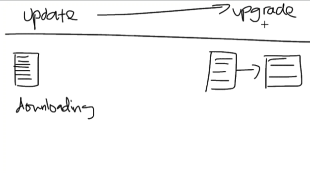

# Shell Commands

### Check the OS name
```bash
uname
```

### OS Info
```bash
uname --help
```

### User Info
```bash
whoami
```

### Exit the instance connection
```bash
exit
```

### Show available shells
```bash
cat /etc/shells
```

### Show command history
```bash
history
```

### Fetch data (e.g., image from a link)
```bash
curl <URL>
```

### Download file with a specific name
```bash
wget --output file.name <URL>
```

Alternative:
```bash
wget -O file.name <URL>
```

### Show file info
```bash
file file.name
```

### Rename file
```bash
mv file.name file.rename
```

### Delete file
```bash
rm file.name
```

### Delete folder
```bash
rm -r folder.name
```

### Create a file
```bash
touch file.name
```

### Edit file
```bash
nano file.name
```

### Show file content
```bash
cat file.name
```

---

## Package Management (Debian-based Linux)

### Update package list
```bash
sudo apt update -y
```
`-y` auto-confirms prompts.

### Upgrade installed packages
```bash
sudo apt upgrade -y
```

### Install `tree` package
```bash
sudo apt install tree -y
```

### View directory tree
```bash
tree
```

### Become root user
```bash
sudo su
```

### Check package status
```bash
sudo systemctl status package.name
```

### Restart a package (e.g., nginx)
```bash
sudo systemctl restart package.name
```

### Enable a package to start on boot
```bash
sudo systemctl enable package.name
```

---

## Bash Scripting

### Shebang (at the top of bash scripts)
```bash
#!/bin/bash
```
> Tells the OS to use the Bash shell to interpret the script.

### Give execute permission to a script
```bash
sudo chmod +x install_nginx.sh
```

### Run the script
```bash
./install_nginx.sh
```

---



---

## Notes

- **Linux does not care about file extensions**  
  e.g., `.txt` is just part of the file name.  
- **Windows and macOS do treat extensions as meaningful.**
