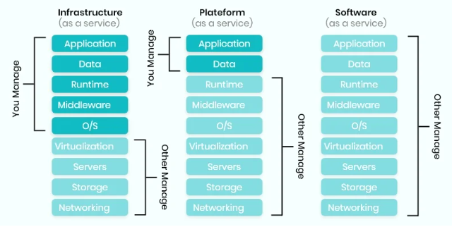

# CLOUD  - Internet based computer service
## Computing Resources Over the Internet on Demand

---

## Cloud History
- Evolved from early concepts of time-sharing and networking in the 60s
- US Dep of Def (ARPANET) (1969) allowed for sharing of resources and data across seperated locations
- Widespread of the internet enabled development of cloud based services

---

## Cloud Business Models

### Public cloud
- Services managed by the cloud provider
- Always over the internet

### Private cloud
- Not sharing any of the resources you interact with anyone else
- e.g. your own mini server
- AWS Gov Cloud Server

### Hybrid cloud
- Mixing public and private together
- e.g. one part of the service on public cloud, one part on the private cloud
- private data on private

### Multi cloud
- Using multiple cloud providers
- e.g. connected to AWS, Azure, GCP
- May need some features from one service than another doesn't have
- Regulation reasons doesn't allow one service in case of service faults

---

## Cloud Service Types

### IAAS - Infrastructure as a Service
- Tend to start with this one
- Renting a server
- AWS, GCP

### PAAS - Platform as a Service
- Renting a environment
- We build the code, just need to platform
- Pycharm, IDE's

### SAAS - Software as a Service
- Renting a software
- Office 365, GitHub, Collab 

### FAAS - Functions of a Service
- 1 off function (adhoc)
- No dedicated server
- Just run this thing, don't care where you do

---

## Data Centres

### Multiple data centres
- Contains the hardware
- Data centres are linked together
- Not always one big data centre

### Availability
- Not necessarily one big data centre
- 3 small centres in the same region
- Used for scalability on faults

### Edges (Hop stations)
- Used to improve the latency
- Needed for regions far from data centres

---

## Advantages of Cloud
- Accessibility
- Scalability
- Price
- Physical security (internal employees)

## Disadvantages of Cloud
- requires Management
- Security concerns
- Reliance on stable internet
- Risk of downtime

---

## Service Payments

### Services you pay for
- Computer Resources (VMs)
- Storage 
- Networking (Data transfer)
- Managed services (databases, ai/ml services, analytic tools)

### Services you dont pay for
- Inbound data transfer
- Open source tools

## Payment Methods

### CapEx - Capital Expenditure
- Pay upfront for the service you need

### OpEx - Operation Expenditure
- Pay for what you use
- Flexible

--- 

## Case Studies

### Spotify to GCP (Google cloud computing)
- Transitioned in 2016 for scalable data handling
- Global streaming infrastructure
- Ensured faster innovation, reduced latency
- Used OpEx payment method

### Coca-Cola to AWS (Amazon web service)
- Marketing Campaigns and Consumer Engagement
- Huge spikes in seasonal events e.g. Superbowl
- Migrated its consumer facing sites to AWS in 2 months
- 40% cost saving, auto-scaling

---

## Main related Cloud Services
- Storage
- Databases
- Data Lakes
- AI/ML
- Analytics

## Big cloud service Providers
- AWS (Amazon Web Service)
- GCP (Google Cloud Computing)
- MSA (Microsoft Azure)